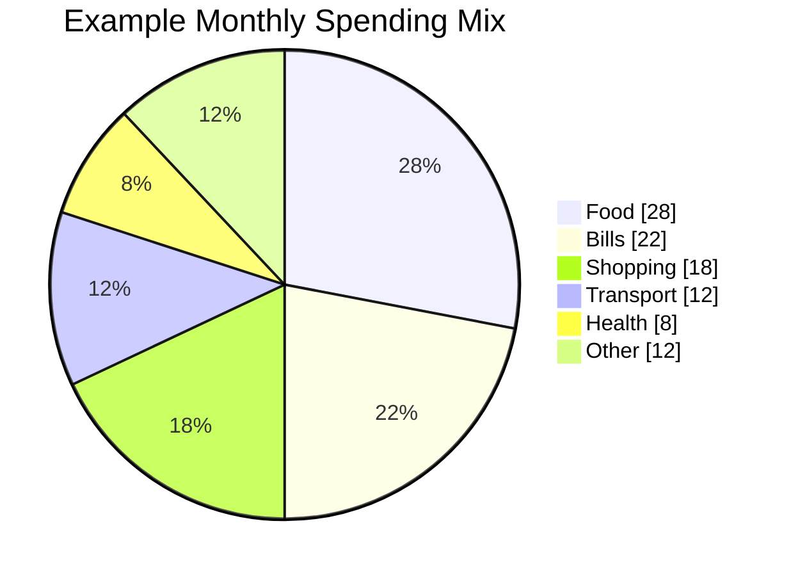
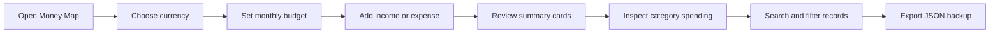
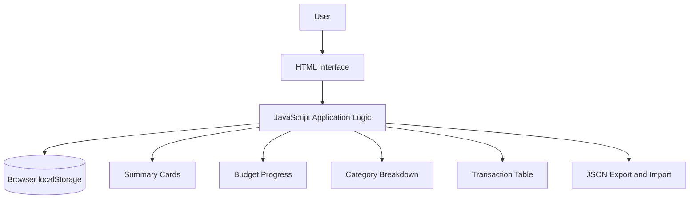
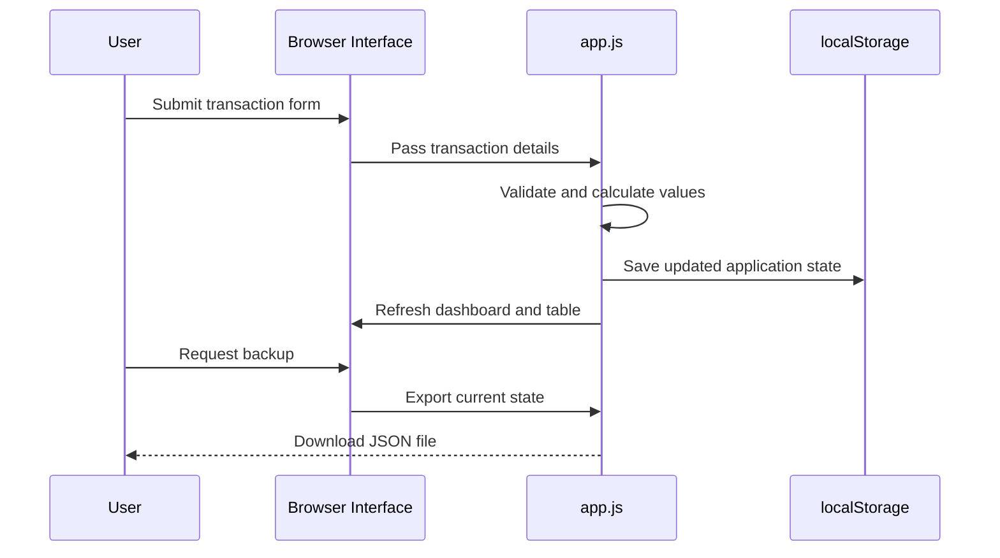
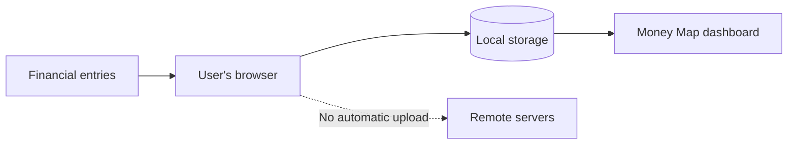
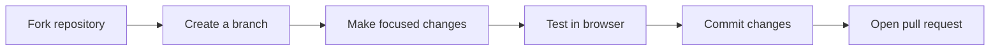

<div align="center">

# 💸 Money Map

### A private, visual, and beginner-friendly personal finance dashboard

Track income, expenses, budgets, and spending patterns directly in your browser — without accounts, servers, or subscriptions.

[](LICENSE)


**[Explore the code](#-project-structure) · [Run locally](#-quick-start) · [Contribute](#-contributing) · [View roadmap](https://github.com/Hirakhyzer/Money/issues/1)**

</div>

---

## 🌟 Why Money Map?

Money Map makes personal finance tracking simple, private, and visual. It runs entirely in the browser and stores data locally, so users remain in control of their financial information.

| Money Map provides | Why it matters |
|---|---|
| 🔒 Local-only storage | Financial records are not sent to a remote server |
| ⚡ Zero setup | Open the app and start immediately |
| 📊 Visual summaries | Understand income, spending, balance, and budget progress quickly |
| 🧾 Transaction management | Add, search, filter, export, restore, and remove records |
| 🌍 Multiple currencies | Use USD, EUR, GBP, CNY, or PKR |
| 📱 Responsive interface | Works across desktop, tablet, and mobile screens |

---

## 🚀 Features

| Feature | Description | Status |
|---|---|:---:|
| 💰 Income and expense tracking | Record transaction type, amount, description, category, and date | ✅ |
| 📈 Monthly financial summary | View income, spending, balance, and activity count | ✅ |
| 🎯 Budget monitoring | Set a monthly spending target and follow progress | ✅ |
| 🧩 Category insights | Compare expenses across spending categories | ✅ |
| 🔎 Search and filtering | Search descriptions and filter income or expenses | ✅ |
| 💾 Backup and restoration | Export and import application data as JSON | ✅ |
| 🌐 Currency preferences | Switch between several common currencies | ✅ |
| 📱 Responsive layout | Use the dashboard comfortably on smaller screens | ✅ |
| 🌙 Dark mode | Planned community enhancement | 🛣️ |
| 📉 Historical trend charts | Planned community enhancement | 🛣️ |

---

## 📊 Visual Overview

### Example monthly spending mix

> This chart uses illustrative values. Money Map calculates its dashboard from the transactions stored in your browser.



### Typical user journey



---

## ⚡ Quick Start

### Run from a cloned repository

```bash
git clone https://github.com/Hirakhyzer/Money.git
cd Money
```

Open `index.html` in a modern browser.

### Run with a local development server

```bash
python -m http.server 8000
```

Then visit:

```text
http://localhost:8000
```

### Requirements

| Requirement | Needed? |
|---|:---:|
| Package installation | ❌ |
| Build command | ❌ |
| Backend server | ❌ |
| Database | ❌ |
| API key | ❌ |
| Modern web browser | ✅ |

---

## 🧠 How It Works

### Application architecture



### Transaction data flow



### Privacy model



| Privacy question | Answer |
|---|---|
| Is an account required? | No |
| Is financial data automatically uploaded? | No |
| Where is application data stored? | Browser `localStorage` |
| What storage key is used? | `money-map-state-v1` |
| Can users make backups? | Yes, through JSON export |
| What happens when browser storage is cleared? | Saved data is removed unless a backup was exported |

---

## 🗂 Project Structure

```text
Money/
├── .github/
│   └── ISSUE_TEMPLATE/
│       ├── bug_report.md
│       └── feature_request.md
├── index.html
├── styles.css
├── app.js
├── CONTRIBUTING.md
├── CODE_OF_CONDUCT.md
├── LICENSE
└── README.md
```

| File or directory | Purpose |
|---|---|
| `index.html` | Dashboard structure, forms, cards, and transaction table |
| `styles.css` | Visual design, layout, components, and responsive behavior |
| `app.js` | State management, calculations, storage, filtering, and backup logic |
| `CONTRIBUTING.md` | Instructions for proposing and submitting improvements |
| `CODE_OF_CONDUCT.md` | Community participation expectations |
| `.github/ISSUE_TEMPLATE/` | Structured bug report and feature request forms |
| `LICENSE` | MIT open-source license |

---

## 🛣️ Roadmap

The project roadmap is maintained in [GitHub issue #1](https://github.com/Hirakhyzer/Money/issues/1).

| Planned enhancement | Difficulty | Status |
|---|:---:|:---:|
| Editable transactions | 🟢 Beginner-friendly | 💡 Planned |
| Custom categories | 🟡 Intermediate | 💡 Planned |
| CSV export | 🟡 Intermediate | 💡 Planned |
| Recurring transactions | 🟡 Intermediate | 💡 Planned |
| Dark mode | 🟢 Beginner-friendly | 💡 Planned |
| Monthly history charts | 🟠 Advanced | 💡 Planned |
| Automated browser tests | 🟠 Advanced | 💡 Planned |
| Progressive Web App support | 🟠 Advanced | 💡 Planned |
| Improved keyboard and screen-reader support | 🟡 Intermediate | 💡 Planned |

---

## 🤝 Contributing

Contributions are welcome from developers, designers, technical writers, students, and first-time open-source contributors.

### Suggested first contributions

| Contribution idea | Good for |
|---|---|
| Improve documentation or wording | First pull request |
| Add dark-mode styles | CSS practice |
| Improve accessibility labels | HTML and accessibility practice |
| Add CSV export | JavaScript practice |
| Add editable transactions | State-management practice |
| Add monthly charts | Data-visualization practice |

Please read [CONTRIBUTING.md](CONTRIBUTING.md) before opening an issue or pull request.

### Contribution workflow



---

## 🧰 Technology Stack

| Technology | Role |
|---|---|
| HTML5 | Semantic page structure |
| CSS3 | Layout, responsive design, and visual styling |
| Vanilla JavaScript | State, calculations, interactions, and persistence |
| Browser localStorage | Local application data storage |
| Mermaid | README diagrams and charts |

---

## 📜 License

Money Map is available under the [MIT License](LICENSE).

---

<div align="center">

### ⭐ Support the project

Star the repository, suggest an improvement, or contribute to the roadmap.

**Built for learning, privacy, and better everyday financial awareness.**

</div>
